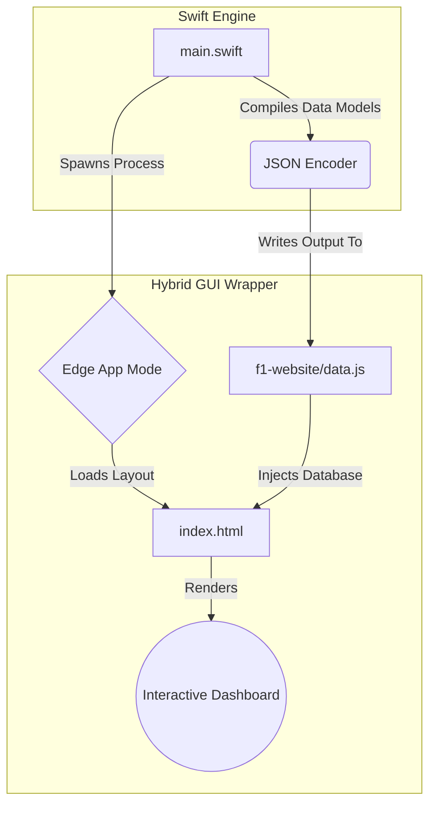

<div align="center">


**A high-performance, cross-platform hybrid desktop application powered by the Swift Engine.**

[](https://swift.org/)
[](https://www.microsoft.com/)
[]()
[]()

---
</div>

## 🏎️ Overview
**F1 Pro Dashboard** is an experimental project that proves the capability of the **Swift Programming Language** running locally on a **Windows System**. It demonstrates how to combine the raw computational speed of Swift as a backend "engine" with the visual richness of HTML/CSS/JS to create a stunning, native-feeling Desktop Application.

The entire backend logic is centralized in a monolithic `main.swift` file.

<br>

## ✨ Premium Features
*   **🧠 Monolithic Swift Engine:** The entire backend data structure, JSON serialization, and Process execution logic runs from a single, highly optimized `main.swift` file.
*   **🏎️ Dynamic Multi-Driver Database:** Includes comprehensive data for *Lewis Hamilton*, *Max Verstappen*, and *Charles Leclerc*.
*   **🎨 Reactive Theming:** The dashboard UI dynamically changes its glowing accent colors based on the selected driver's team (e.g., Petronas Teal, Red Bull Blue, Ferrari Red).
*   **📊 Interactive Data Visualization:** Utilizes `Chart.js` for rendering a fluid, animated career performance line chart.
*   **🖥️ Hybrid App Mode:** Completely bypasses standard browser UI by launching Microsoft Edge in `--app` mode, delivering a true Desktop App experience.

<br>

## ⚙️ Architecture Workflow

The application follows a sophisticated cross-platform pipeline entirely orchestrated by a single Swift file:

1. **🚀 Initialization (`main.swift`)**: The core Swift engine launches. It parses the custom `F1Driver` structs and builds complex arrays containing driver stats, team colors, and local asset paths.
2. **🔄 JSON Serialization**: The engine automatically converts the raw Swift data models into a secure JSON string using `JSONEncoder` and exports it directly as a JavaScript variable into `f1-website/data.js`.
3. **🖥️ GUI Spawning (`Foundation.Process`)**: Swift leverages the Windows command shell to forcefully spawn an isolated instance of Microsoft Edge in `--app` mode, stripping away typical browser UI to create a native desktop window.
4. **🎨 Frontend Injection**: The spawned window executes `index.html`. The frontend immediately reads the `data.js` database injected by Swift, reacting to the state to render the animations, sidebar buttons, and interactive `Chart.js` graphs.

### Visual Representation:


<br>

## 🚀 How to Run (Windows)

Ensure you have the [Swift Toolchain for Windows](https://www.swift.org/download/#windows) installed.

1. **Clone or Open the Repository** in your IDE (e.g., IntelliJ, VS Code).
2. **Open the Terminal** within the root directory (`LatihanSwift/`).
3. **Execute the Swift Compiler:**
```bash
swift run
```
4. **Enjoy the App!** A standalone F1 Dashboard application will instantly launch on your desktop.

<br>

## 📂 Project Structure
```text
LatihanSwift/
├── Package.swift               # Swift Package Configuration
├── Sources/
│   └── LatihanSwift/
│       └── main.swift          # 🧠 THE MONOLITHIC CORE
└── f1-website/                 # 🎨 UI / Rendering Layer
    ├── index.html              # Layout
    ├── styles.css              # Premium Animations & Colors
    ├── script.js               # Logic & DOM manipulation
    └── assets/                 # Generated High-Res Images
```

<br>

---
<div align="center">
<i>Built with adrenaline and Swift. 🏁</i>
</div>
